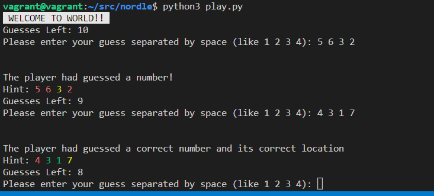

# NORDLE
Welcome to NORDLE (Number Wordle) game.

This game is very simple. Your goal is to guess a 4 digit pattern that computer comes up with. Each digit will be between 0 - 7. You will have 10 tries to guess the number.

## Extensions Implemented
- Show hint in different colors.
- Keep track of score (total attempts/won/lost).
- Show the hidden pattern on demand for debugging/testing.
- Allow user to change the size of pattern.
- Allow user to change the max value of each digit.
- Allow user to change the game from numbers to characters.
- Added unit tests to test game play.

This game comes in two flavors: Terminal based & library based.

## Terminal Based Version
Here is how you can run this game.
```
python3 -m pip install -r requirements.txt
python3 play.py
```
### Screenshot


### Command Line Options
You can specify command line arguments to tweak the behavior of the game.
| Option| Behavior|
| --- | --- |
| -n | Do not display hints. This will hide the hints that you see after each try. |
| -d | Debug Mode. This will print the pattern that you have to guess at the start. |
| -m *COUNT* | Max number of guesses a player can make. By default it's 10. |
| -p *COUNT* | Length of pattern to guess. By default it's 4. |
| -c | Switch to character based guesses. By default it's digit based. |
| -h | Display all command line arguments |

## Using NORDLE as Python Library
If you want to integrate NORDLE in your app you can import this and use it. Here is high level overview of all the classes and their purpose.
|Class|Description|
|--|--|
| class Nordle | This is the main game. |
| class Options | This class allows you to configure Nordle as per your liking. |
| class Status | This class is used to check the current status of the game. |
| class GuessResult | Object of this class is returned every time you make a guess. It contains details about your guess. |
| class PatternGeneratorBase | Base class for writing your own pattern generator. |
| class RandomOrgPatternGenerator | Pattern generator that uses Random.org for generating random numbers. |
| class CharacterPatternGenerator | Pattern generator that generates character based patterns. |


# Building NORDLE
Before you continue make sure you have all the pre-requsits installed. Use this command to install them.
```
python3 -m pip install -r requirements.txt
```

### Code Formatting
```
black .
```

### Type Checking
```
mypy .
```

### Run Tests Only
You can run tests with
```
python3 tests.py
```
### Run Tests and Detailed Code Coverage Report
Run these
```
coverage run --source=. tests.py
coverage html
```
Once you run these commands the report will be stored in a new folder called "htmlcov". You can view that report by opening **[htmlconv/index.html](htmlconv/index.html)** in browser.
